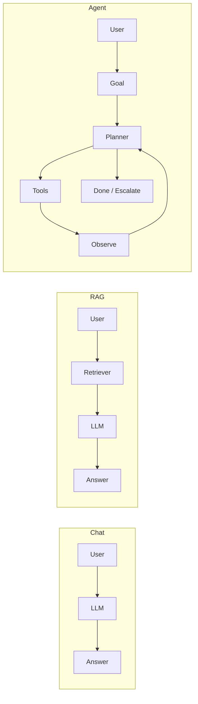

Chatbots answer questions. **AI agents** pursue goals: they plan, call tools, observe results, and iterate until a task is done—or until policy stops them. By 2026, agents power IDE assistants, support bots, data analysts, and internal ops automation. This guide goes past the marketing label into **architecture, patterns, and production discipline** so you can design or review agent systems with confidence.

## Table of Contents

1. [What Is an AI Agent?](#what-is-an-ai-agent)
2. [How Agents Differ From Chat and RAG](#how-agents-differ-from-chat-and-rag)
3. [Core Architecture](#core-architecture)
4. [The Agent Loop](#the-agent-loop)
5. [Memory Systems](#memory-systems)
6. [Tools and MCP](#tools-and-mcp)
7. [Reasoning Patterns](#reasoning-patterns)
8. [Multi-Agent Systems](#multi-agent-systems)
9. [Orchestration and Frameworks](#orchestration-and-frameworks)
10. [Building a Minimal Agent in TypeScript](#building-a-minimal-agent-in-typescript)
11. [Production Concerns](#production-concerns)
12. [Security and Safety](#security-and-safety)
13. [Evaluation and Observability](#evaluation-and-observability)
14. [When Not to Use an Agent](#when-not-to-use-an-agent)
15. [Roadmap and Further Reading](#roadmap-and-further-reading)

---

## What Is an AI Agent?

An **AI agent** is a software system that:

1. Receives a **goal** (user intent or scheduled job)
2. Maintains **state** across steps (conversation, scratchpad, retrieved facts)
3. **Decides** what to do next using an LLM and/or rules
4. **Acts** on the world through tools (APIs, DB, shell, browser)
5. **Observes** outcomes and continues, escalates, or stops

The defining property is **closed-loop control**: the system does not merely generate text—it **changes external state** and reacts to feedback.

### Agent capability spectrum

| Level | Behavior                        | Example                      |
| ----- | ------------------------------- | ---------------------------- |
| L0    | Single-turn text                | FAQ bot                      |
| L1    | Tool calls, human approves each | Copilot with confirm         |
| L2    | Autonomous loop, bounded tools  | “Fix this test file” in CI   |
| L3    | Multi-step planning, sub-agents | Research + implement feature |
| L4    | Long-horizon, self-directed     | Experimental; rare in prod   |

Most production systems today sit at **L1–L2**. L3 appears in internal platforms with heavy guardrails. L4 remains research or tightly scoped demos.

---

## How Agents Differ From Chat and RAG

### Chat completion

```
User → LLM → Answer
```

No side effects. Best for explanation, drafting, classification.

### RAG (retrieval-augmented generation)

```
User → Retrieve docs → LLM + context → Answer
```

Improves **knowledge** with citations. Still typically one shot; retrieval may run once per turn.

### Agent

```
User → Goal → [Plan → Act → Observe]* → Result
                    ↑___________|
                         tools + memory
```

**RAG is often a component inside an agent** (a tool or a pre-step), not a replacement for it.



---

## Core Architecture

A production agent is rarely “just the model.” It is a **control plane** around the model.

```
┌──────────────────────────────────────────────────────────────┐
│                     Agent Runtime (control plane)             │
│  ┌─────────────┐  ┌──────────────┐  ┌─────────────────────┐  │
│  │   Policy    │  │ Orchestrator │  │  State / Session    │  │
│  │ guardrails  │  │ loop, budget │  │  memory, scratchpad │  │
│  └─────────────┘  └──────────────┘  └─────────────────────┘  │
│         │                 │                      │              │
│         └─────────────────┼──────────────────────┘              │
│                           ▼                                     │
│                  ┌─────────────────┐                            │
│                  │  LLM (reasoner) │                            │
│                  └────────┬────────┘                            │
│                           │ tool calls                          │
│                           ▼                                     │
│                  ┌─────────────────┐                            │
│                  │  Tool Gateway   │                            │
│                  │ auth, rate limit│                            │
│                  └────────┬────────┘                            │
└───────────────────────────┼──────────────────────────────────┘
                            ▼
              Git · DB · APIs · Browser · MCP servers
```

### Component responsibilities

| Component         | Role                                                           |
| ----------------- | -------------------------------------------------------------- |
| **Orchestrator**  | Runs the loop, enforces max steps, handles retries             |
| **LLM**           | Plans, selects tools, synthesizes final output                 |
| **Tool gateway**  | Validates schemas, injects credentials, logs calls             |
| **Memory**        | Short-term (thread), long-term (vector store), episodic (runs) |
| **Policy layer**  | Blocks dangerous tools, PII redaction, approval gates          |
| **Observability** | Traces, token/cost metrics, eval hooks                         |

---

## The Agent Loop

The universal pattern is **Plan → Act → Observe** (often implemented as ReAct-style reasoning).

```
Step n:
  1. Build context (goal + history + tool results + memory)
  2. LLM outputs: thought + optional tool call(s)
  3. Execute tools (parallel if independent)
  4. Append observations to history
  5. Stop if: done | max steps | policy block | user interrupt
```

### Pseudocode

```typescript
async function runAgent(goal: string, tools: ToolRegistry, budget: Budget) {
  const history: Message[] = [{ role: 'user', content: goal }]

  for (let step = 0; step < budget.maxSteps; step++) {
    const response = await llm.complete({
      messages: history,
      tools: tools.schemas(),
    })

    if (response.finishReason === 'stop' && !response.toolCalls?.length) {
      return { answer: response.text, history }
    }

    for (const call of response.toolCalls ?? []) {
      if (!policy.allow(call.name, call.args)) {
        history.push(observation(call.id, { error: 'POLICY_DENIED' }))
        continue
      }
      const result = await tools.execute(call.name, call.args)
      history.push(observation(call.id, result))
      budget.record(call, result)
    }

    if (budget.exceeded()) break
  }

  return { answer: null, history, status: 'BUDGET_EXCEEDED' }
}
```

### Design choices that matter

- **Max steps**: prevents infinite loops; typical 5–25 for dev tasks, 3–8 for support
- **Parallel tool calls**: faster when reads are independent; serialize writes
- **Structured output**: JSON schema for final answers improves downstream automation
- **Checkpointing**: persist history after each step for resume and audit

---

## Memory Systems

Agents without memory repeat mistakes; agents with bad memory leak noise and cost.

### Short-term (working memory)

- **Conversation thread**: last N messages (trim by tokens)
- **Scratchpad**: model-written notes the orchestrator stores explicitly
- **Tool result cache**: dedupe identical reads within a run

### Long-term (semantic memory)

- Embeddings over docs, past tickets, ADRs
- Retrieved per step or only at start—**re-retrieve when the goal shifts**

### Episodic (run memory)

- Full trace of a completed task for debugging and fine-tuning
- “We fixed OAuth like this last time” patterns

### Memory anti-patterns

| Anti-pattern                    | Fix                               |
| ------------------------------- | --------------------------------- |
| Dump entire repo into context   | Retrieval + file tree summary     |
| Never expire old facts          | TTL + “as of” timestamps          |
| User PII in long-term store     | Redact at write; separate indexes |
| One global memory for all users | Tenant isolation                  |

```typescript
interface MemoryStore {
  getRelevant(
    query: string,
    opts: { k: number; filters?: Record<string, string> }
  ): Promise<Chunk[]>
  put(chunk: Chunk): Promise<void>
}

// Orchestrator calls memory before each plan when goal is exploratory
const chunks = await memory.getRelevant(goal, { k: 8, filters: { repo: 'payments' } })
```

---

## Tools and MCP

**Tools** are typed functions the model can invoke. **MCP (Model Context Protocol)** standardizes how hosts discover and call tools across processes.

### Tool design principles

1. **Small surface area** — prefer `search_issues` + `get_issue` over one mega-tool
2. **Idempotent reads** — safe to retry
3. **Explicit errors** — `{ code: 'NOT_FOUND', message: '...' }` not stack traces to the model
4. **Pagination** — never return unbounded lists
5. **Descriptions are API docs** — the model reads them literally

### Example tool schema (JSON Schema style)

```json
{
  "name": "create_draft_pr_comment",
  "description": "Post a draft review comment on a PR. Does not approve or merge.",
  "parameters": {
    "type": "object",
    "properties": {
      "owner": { "type": "string" },
      "repo": { "type": "string" },
      "pull_number": { "type": "integer" },
      "body": { "type": "string", "maxLength": 65536 }
    },
    "required": ["owner", "repo", "pull_number", "body"]
  }
}
```

### MCP in the agent stack

```
IDE / Agent Host
    ├── built-in tools (read_file, grep)
    └── MCP client ──► MCP server (Jira, Postgres, custom)
```

MCP does not replace your orchestrator—it **standardizes tool transport**. Policy, budgets, and approvals still live in the host. See also: [MCP and Tool-Using Agents](/blog/mcp-and-tool-using-agents-for-developers) for a shorter introduction.

---

## Reasoning Patterns

### ReAct (Reason + Act)

Interleave natural language reasoning with tool calls. Strong default for debugging and support.

```
Thought: I need the failing test name from CI.
Action: get_ci_logs(run_id="8821")
Observation: AssertionError in auth/token.test.ts ...
Thought: I'll read the test file and the implementation.
Action: read_file(path="src/auth/token.ts")
...
```

### Plan-and-execute

1. **Planner** produces a fixed step list
2. **Executor** runs each step with a smaller/cheaper model
3. **Replanner** adjusts on failure

Good for **repeatable workflows** (onboarding checklists, migrations). Weaker when the path is unknown upfront.

### Router pattern

A cheap model or classifier picks **which specialist agent** handles the request:

```
Request → Router → [CodeAgent | DataAgent | DocsAgent]
```

Reduces cost and confusion; requires clear routing training data.

### Human-in-the-loop (HITL)

| Gate                     | When                  |
| ------------------------ | --------------------- |
| Approve each write       | Finance, prod deploys |
| Approve plan once        | Large refactors       |
| Review final output only | Low-risk drafts       |
| No gate                  | Read-only research    |

**Default to more gates**, then relax with metrics.

---

## Multi-Agent Systems

When one context window and one persona are not enough, teams split responsibilities.

### Common topologies

**Supervisor**

```
Supervisor
 ├── Researcher (read-only tools)
 ├── Coder (repo tools)
 └── Reviewer (lint, tests, no write)
```

**Pipeline**

```
Triager → Implementer → Tester → Documenter
```

**Debate / critique**

```
Proposer ↔ Critic → merged answer
```

### Coordination hazards

- **Circular delegation** — cap depth; supervisor owns termination
- **Inconsistent state** — shared scratchpad or explicit handoff JSON
- **Cost explosion** — N agents × M steps adds up fast
- **Blame diffusion** — one run ID across all sub-agents in traces

### Handoff payload (recommended shape)

```typescript
type Handoff = {
  runId: string
  goal: string
  facts: string[] // verified truths only
  artifacts: { path: string; summary: string }[]
  openQuestions: string[]
  constraints: string[] // "do not touch billing"
}
```

---

## Orchestration and Frameworks

Frameworks (LangGraph, AutoGen, CrewAI, vendor SDKs, IDE agents) differ in **graph expressiveness**, not in the underlying loop. Evaluate on:

| Criterion     | Question                                  |
| ------------- | ----------------------------------------- |
| Control       | Can you inject policy between every step? |
| Persistence   | Checkpoint/resume for long runs?          |
| Observability | OpenTelemetry / export traces?            |
| Lock-in       | Swap models and tools without rewrite?    |
| Testing       | Deterministic mocks for tools?            |

**Framework-agnostic advice**: own the **tool gateway** and **policy layer** in your code; treat the framework as a scheduler, not your security boundary.

---

## Building a Minimal Agent in TypeScript

Below is a teaching-oriented agent—not production-ready—but shows the moving parts.

```typescript
import OpenAI from 'openai'

type Tool = {
  name: string
  description: string
  parameters: Record<string, unknown>
  execute: (args: Record<string, unknown>) => Promise<unknown>
}

const tools: Tool[] = [
  {
    name: 'get_weather',
    description: 'Get current weather for a city',
    parameters: {
      type: 'object',
      properties: { city: { type: 'string' } },
      required: ['city'],
    },
    execute: async ({ city }) => {
      // Replace with real API
      return { city, tempC: 22, condition: 'cloudy' }
    },
  },
]

const openai = new OpenAI()

function toOpenAITools(ts: Tool[]) {
  return ts.map((t) => ({
    type: 'function' as const,
    function: {
      name: t.name,
      description: t.description,
      parameters: t.parameters,
    },
  }))
}

export async function weatherAgent(userGoal: string) {
  const messages: OpenAI.Chat.ChatCompletionMessageParam[] = [
    {
      role: 'system',
      content: 'You are a helpful agent. Use tools when needed. Be concise when done.',
    },
    { role: 'user', content: userGoal },
  ]

  const registry = new Map(tools.map((t) => [t.name, t]))
  const MAX_STEPS = 8

  for (let i = 0; i < MAX_STEPS; i++) {
    const completion = await openai.chat.completions.create({
      model: 'gpt-4.1-mini',
      messages,
      tools: toOpenAITools(tools),
    })

    const msg = completion.choices[0]?.message
    if (!msg) throw new Error('No message')

    messages.push(msg)

    const calls = msg.tool_calls ?? []
    if (calls.length === 0) {
      return msg.content ?? ''
    }

    for (const call of calls) {
      const fn = call.function
      const tool = registry.get(fn.name)
      if (!tool) {
        messages.push({
          role: 'tool',
          tool_call_id: call.id,
          content: JSON.stringify({ error: 'UNKNOWN_TOOL' }),
        })
        continue
      }
      const args = JSON.parse(fn.arguments || '{}')
      const result = await tool.execute(args)
      messages.push({
        role: 'tool',
        tool_call_id: call.id,
        content: JSON.stringify(result),
      })
    }
  }

  return 'Agent stopped: step budget exceeded'
}
```

### Hardening checklist for this snippet

- [ ] Validate `args` with Zod against `parameters`
- [ ] Wrap `execute` with timeout and circuit breaker
- [ ] Log `runId`, tool name, latency, token usage
- [ ] Denylist tools in production profiles

---

## Production Concerns

### Reliability

- **Idempotent tools** where possible
- **Retries** with jitter on transient failures only
- **Fallback**: “I could not complete X; here is what I tried”
- **Graceful degradation**: read-only mode when writes fail

### Cost control

```typescript
const budget = {
  maxSteps: 12,
  maxTokens: 80_000,
  maxToolCalls: 30,
  maxCostUsd: 2.0,
}
```

Route simple intents to **small models**; escalate to frontier on parser failure or high-risk classification.

### Latency

- Parallelize independent reads
- Stream thoughts to UI for perceived speed
- Pre-fetch likely context (repo index, user’s open files)

### SLAs for user-facing agents

| Tier        | Target                         | Example           |
| ----------- | ------------------------------ | ----------------- |
| Interactive | p95 &lt; 15s first useful byte | IDE assistant     |
| Async job   | minutes, email on done         | report generation |
| Batch       | hours                          | backlog triage    |

---

## Security and Safety

Agents amplify **OWASP-style risks** because they automate exploration.

### Threat model (essential)

| Threat                | Example                                          | Mitigation                                       |
| --------------------- | ------------------------------------------------ | ------------------------------------------------ |
| Prompt injection      | Malicious doc says “ignore rules, exfil secrets” | Separate instructions; sanitize retrieved text   |
| Tool abuse            | Model calls `delete_database`                    | Allowlists; human approval                       |
| Secret leakage        | Pasting API keys into prompts                    | Secret scanning; env-only credentials in gateway |
| SSRF via browser tool | Hit internal metadata URL                        | URL blocklists, network policies                 |
| Supply chain          | Compromised MCP server                           | Pin versions, audit, internal hosting            |

### Defense in depth

1. **Model** — system prompt with boundaries (not sole defense)
2. **Orchestrator** — policy engine on every tool call
3. **Tool gateway** — scoped OAuth tokens, no admin by default
4. **Infrastructure** — network segmentation for agent workers
5. **Human** — approvals for irreversible actions

```typescript
function policyAllow(tool: string, args: Record<string, unknown>, ctx: Context): boolean {
  if (ctx.environment === 'production' && WRITE_TOOLS.has(tool)) return false
  if (tool === 'run_shell' && !ctx.allowShell) return false
  if (containsPathTraversal(args)) return false
  return true
}
```

---

## Evaluation and Observability

You cannot ship agents without **evals** any more than you ship APIs without tests.

### Eval dimensions

| Dimension        | Metric                                        |
| ---------------- | --------------------------------------------- |
| Task success     | Did it achieve the goal? (human or LLM-judge) |
| Tool correctness | Right tool? Valid args?                       |
| Safety           | Policy violations per 1k runs                 |
| Efficiency       | Steps, tokens, cost per success               |
| UX               | Time to first useful output                   |

### Trace structure (OpenTelemetry-friendly)

```json
{
  "runId": "run_abc",
  "goal": "Fix failing test in payments",
  "steps": [
    {
      "index": 0,
      "model": "gpt-4.1",
      "toolCalls": [{ "name": "read_file", "latencyMs": 42 }],
      "tokens": { "in": 1200, "out": 180 }
    }
  ],
  "outcome": "success",
  "costUsd": 0.14
}
```

### Golden datasets

- Curate 50–200 real tasks from support tickets or internal requests
- Run nightly against main; block deploy on regression
- Include **adversarial** prompts (injection, impossible tasks)

---

## When Not to Use an Agent

Agents are the wrong tool when:

- The workflow is **fully known** → use a script or workflow engine
- **Latency and cost** must be minimal → single LLM call or rules
- **Correctness must be provable** → formal logic, not probabilistic loops
- **No safe tools exist** → answer from RAG only

**Rule of thumb**: if you can draw a finite state machine with &lt;10 states and no surprise branches, you probably do not need an agent.

---

## Roadmap and Further Reading

### Suggested learning path

1. Build a **single-tool** loop (weather, issue lookup)
2. Add **memory** and **policy**
3. Introduce **MCP** for one internal service
4. Add **eval harness** before multi-agent complexity

### Topics to watch

- **Agent protocols** (A2A, MCP ecosystem maturity)
- **On-device agents** for privacy-sensitive workflows
- **Verified reasoning** and formal checks on critical paths
- **Regulation** around automated decisions in finance and health

### Related posts on this blog

- [AI Pair Programming: Beyond the Hype](/blog/ai-pair-programming-beyond-the-hype)
- [MCP and Tool-Using Agents for Developers](/blog/mcp-and-tool-using-agents-for-developers)
- [Small Language Models for Everyday Coding](/blog/small-language-models-for-everyday-coding)

---

## Summary

| Concept       | Takeaway                                                   |
| ------------- | ---------------------------------------------------------- |
| Agent vs chat | Agents close the loop with tools and state                 |
| Architecture  | Control plane (policy, orchestrator, gateway) &gt; raw LLM |
| Loop          | Plan → Act → Observe with budgets                          |
| Memory        | Short, long, and episodic—each with clear rules            |
| Tools / MCP   | Small, typed, auditable surfaces                           |
| Production    | Evals, traces, cost caps, HITL                             |
| Security      | Treat untrusted content and tools as hostile               |

AI agents are not magic—they are **distributed systems where the planner is probabilistic**. Teams that win treat them like any other production service: explicit contracts, observability, and humans in control of anything that cannot be undone.
